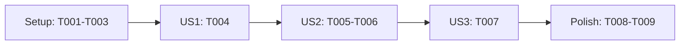

# Tasks: Professional Resume Website

**Input**: Design documents in `specs/002-professional-resume-website/`

**Prerequisites**: `plan.md`, `spec.md`, `research.md`, `data-model.md`, and `quickstart.md`

**Tests**: No automated test tasks are included because the specification does not request a test-driven workflow. Each user story has an independent acceptance check below; the release constitution still requires manual accessibility, responsive, link, privacy, performance, and print review.

**Organization**: Tasks are grouped by user story. Paths follow the plan's static-site structure: the public site is under `docs/`, and repo-level publishing guidance is in `README.md`.

## Phase 1: Setup (Shared Infrastructure)

**Purpose**: Establish the static page, shared styling foundation, and local/GitHub Pages instructions.

- [X] T001 [P] Create the semantic static-page shell, metadata, landmarks, and relative stylesheet reference in `docs/index.html`; do not add guessed personal details.
- [X] T002 [P] Create the stylesheet with accessible base typography, layout defaults, focus visibility, reduced-motion handling, and design tokens for the navy, warm off-white, teal, and restrained amber palette in `docs/styles.css`.
- [X] T003 [P] Document local preview and GitHub Pages publishing from the default branch's `/docs` directory in `README.md`.

---

## Phase 2: Foundational (Blocking Prerequisites)

**Purpose**: Shared prerequisites that must be complete before story work.

No additional foundational tasks are required: this static site has no backend, database, framework, or runtime dependency. Complete Phase 1 before starting the stories.

---

## Phase 3: User Story 1 - Present a polished resume (Priority: P1) 🎯 MVP

**Goal**: Present the candidate's verified professional background as a clear, concise resume.

**Independent Test**: Review the completed resume as a standalone document and confirm a prospective employer can locate the candidate's professional focus, experience, skills, and education without relying on the website's navigation.

- [X] T004 [US1] Obtain the owner's verified name, professional focus, summary, roles, organizations, supplied dates, skills, education, and optional approved details; populate `docs/index.html` with concise, consistent sections that distinguish responsibilities from outcomes, omit unsupported sections, and do not invent facts.

**Checkpoint**: The page contains a truthful, scannable resume using only owner-approved details; no unverified personal content is ready for publication.

---

## Phase 4: User Story 2 - Review the resume online (Priority: P1)

**Goal**: Make the same verified resume clear, professional, visually distinctive, responsive, and easy to contact from online.

**Independent Test**: Open the page at phone and desktop widths. Confirm visitors can identify the candidate and scan the resume, the design uses the planned tasteful palette, there is no horizontal scrolling, and each approved contact/profile action reaches its intended destination.

- [X] T005 [US2] Apply a polished modern editorial visual hierarchy, generous whitespace, responsive layout, readable section treatments, and the planned navy/warm-neutral/teal palette in `docs/styles.css`.
- [X] T006 [P] [US2] Add only owner-approved email and professional-profile links with descriptive labels and correct destinations in `docs/index.html`.

**Checkpoint**: The verified resume reads well on common narrow and wide screens, and every displayed contact/profile action is valid.

---

## Phase 5: User Story 3 - Save or print a copy (Priority: P2)

**Goal**: Let visitors produce a complete, clean standalone copy from the website.

**Independent Test**: Use the browser's print or save-to-PDF action and confirm the complete resume is legible, sections are not clipped, and website-only controls do not obstruct the printed content.

- [X] T007 [US3] Add print-specific layout rules that hide navigation and other non-resume controls, preserve readable type and links, and prevent clipped sections in `docs/styles.css`.

**Checkpoint**: A visitor can save or print the full resume as a legible document in a single attempt.

---

## Phase 6: Polish & Cross-Cutting Concerns

**Purpose**: Complete the visual-quality and public-release safeguards required across stories.

- [X] T008 Refine spacing, type scale, small-screen behavior, focus states, and color pairings in `docs/styles.css` so the finished design remains professional and its text contrast meets WCAG 2.2 AA.
- [X] T009 Add the owner-approval, public-information, `docs/` publishing-scope, and final GitHub Pages release checklist to `README.md`.

---

## Dependencies & Execution Order

### Phase Dependencies

- **Setup (Phase 1)**: No prerequisites; T001–T003 can be completed in parallel because they edit separate files.
- **Foundational (Phase 2)**: No separate tasks; Phase 1 establishes the complete static foundation.
- **User Stories (Phases 3–5)**: Start after Phase 1. Complete US1 before US2 because online layout and links rely on the verified resume content. Complete US2 before US3 because print rules refine the final site presentation.
- **Polish (Phase 6)**: Complete after all stories; T008 and T009 can run in parallel because they edit separate files.

### User Story Dependencies

- **User Story 1 (P1)**: Begins after setup; no dependency on another story. Requires the owner to supply or verify personal and career facts. Do not substitute fabricated sample content if details are unavailable.
- **User Story 2 (P1)**: Follows US1 because the online presentation and contact actions must use the same verified resume facts.
- **User Story 3 (P2)**: Follows US2 because print output must match the final online resume and controls.

### Parallel Opportunities

- **Setup**: T001 (`docs/index.html`), T002 (`docs/styles.css`), and T003 (`README.md`) may run concurrently.
- **User Story 2**: T005 (`docs/styles.css`) and T006 (`docs/index.html`) may run concurrently after T004; the stylesheet can target the semantic elements established by T001/T004.
- **Polish**: T008 (`docs/styles.css`) and T009 (`README.md`) may run concurrently.

### Dependency Graph

---

## Implementation Strategy

### MVP First

Because both the resume and its website are explicit core deliverables, the MVP is **Setup + US1 + US2**. US1 alone produces the verified resume content but not the requested polished online presence. Hold publication until the owner approves the actual profile details and links.

### Incremental Delivery

1. Complete Setup and confirm the static shell and preview/publishing guidance.
2. Complete US1 with owner-approved resume facts; omit any unprovided optional sections.
3. Complete US2 and publish a responsive, professional resume page with working approved links.
4. Complete US3 to add a clean print/save presentation.
5. Complete Polish safeguards before sharing the public URL.

## Notes

- Every task has a sequential ID, required checkbox, optional parallel marker, story label where applicable, and an explicit file path.
- No automated test-generation tasks were added; user-story acceptance checks and release reviews remain required.
- The candidate's real resume content and approved contact details were not supplied in the request. T004 must obtain them from the owner; no content may be fabricated.
